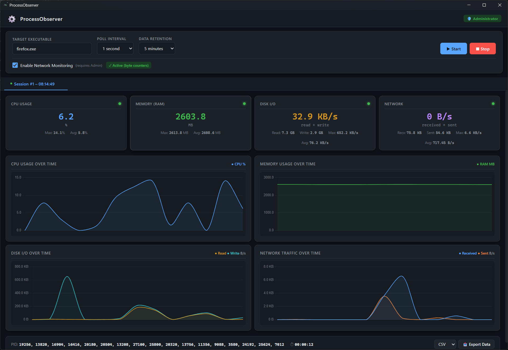

<p align="center">
  
</p>

<h1 align="center">ProcessObserver</h1>

<p align="center">
  <strong>Real-time CPU, memory, disk I/O and network monitoring for Windows processes</strong><br />
  A lightweight, dark-themed desktop app built with Rust, Tauri v2 and Chart.js
</p>

<p align="center">
  <a href="https://github.com/BitsAndCrumbs/ProcessObserver"></a>
  <a href="https://github.com/BitsAndCrumbs/ProcessObserver"></a>
  <a href="https://github.com/BitsAndCrumbs/ProcessObserver"></a>
  <a href="./LICENSE"></a>
</p>

---

### Current Release

**v0.9.0** — Windows x64 installer:

[Download ProcessObserver v0.9.0 (MSI)](https://github.com/BitsAndCrumbs/ProcessObserver/releases/download/v0.9.0/ProcessObserver_0.9.0_x64_en-US.msi)

---

### What is ProcessObserver?

**ProcessObserver** is a native Windows desktop application that watches CPU usage, memory (working set), disk I/O and network activity of any running process — in real time.

You type an executable name such as `firefox.exe`, pick a polling interval, and the app finds every matching process, aggregates their statistics, and plots them on live charts. Multiple executables can be monitored at the same time, each in its own tab, and every session can be exported to CSV or JSON for later analysis.

It is a small, focused replacement for the Windows **Resource Monitor** aimed at developers who want a fast way to see what a specific process is doing — without digging through the full task list.

### ✨ Features

- **Real-time metrics** — CPU %, RAM (working set), disk I/O (read/write) and network traffic
- **Multi-session tabs** — monitor several executables in parallel without losing any data
- **Automatic PID resolution** — one name matches every running instance; their values are aggregated
- **Live charts** — four graphs per session (CPU, RAM, I/O, Network) with min/max/avg summaries
- **Process autocomplete** — a suggestion list of currently running processes
- **Admin elevation** — network byte counters trigger a UAC prompt and restart elevated
- **Data export** — any session to CSV (Excel-ready) or JSON with full metadata
- **Bounded memory** — retention windows and a hard cap keep long sessions from leaking memory

---

## ⚙️ Options

All settings live in the sticky control bar at the top of the window.

| Option | What it does | Available values |
|--------|--------------|------------------|
| **Target executable** | Name of the process to watch (all matching PIDs are aggregated) | any process name, e.g. `firefox.exe`, `node.exe`, `chrome.exe` |
| **Poll interval** | How often metrics are sampled | `500 ms`, `1 s` *(default)*, `2 s`, `5 s`, `10 s` |
| **Data retention** | How much history is kept per session (older points are dropped) | `1 min`, `5 min` *(default)*, `10 min`, `30 min`, `1 h` |
| **Network monitoring** | Enables the network metric | toggle; see below |
| **Export format** | Format used by the **Export Data** button in each session | `CSV` or `JSON` |

### Network monitoring modes

Network data behaves differently depending on whether the app runs as Administrator:

- **Elevated (Administrator)** — true per-connection byte counters are read from the TCP Extended Statistics (ESTATS) subsystem. The chart shows **received vs. sent** bytes.
- **Not elevated** — the app can only count active TCP connections per process. This is shown as a degraded mode, and you are offered a one-click restart with Administrator privileges.

> The pending configuration (executable, interval, retention, network toggle) is carried over automatically when the app restarts elevated.

---

## 🖥️ Screenshots



---
## 💡 Idea & Credits

The concept of a lightweight, per-process performance monitor is inspired by **[@ComputationalReflection/ProcessPerformance](https://github.com/ComputationalReflection/ProcessPerformance)**. ProcessObserver is an independent implementation that builds on the same core idea — watching individual processes in real time — while adding multi-session tabs, configurable polling and retention, network monitoring, and CSV/JSON export on top of a Rust + Tauri v2 foundation.

---
## 🤝 Contributing

Contributions are welcome! Please open an issue first to discuss larger changes.

Ideas that would be especially valuable:

- Threshold-based notifications (e.g. alert when CPU exceeds 80%)
- Minimize-to-tray with a status indicator
- `PDH` (Performance Data Helper) support as an alternative metric backend
- More granular per-protocol network breakdowns

### Prerequisites

- **Windows 10** or later (x86_64)
- **Rust** 1.80+ — [rustup](https://rustup.rs/)
- **Node.js** 18+ with npm
- **Microsoft Visual C++ Build Tools** (or Visual Studio with the C++ workload) — required to compile `windows-rs`


### Run from source

```powershell
# 1. Clone the repository
git clone https://github.com/BitsAndCrumbs/ProcessObserver.git
cd ProcessObserver

# 2. Install frontend dependencies
npm install

# 3. Run in development mode (hot reload)
npx tauri dev
```
### Build a release installer

```powershell
npx tauri build
```

The installers are written to `src-tauri/target/release/bundle/`.


### 📁 Project Structure

```
ProcessObserver/
├── src/                              # Frontend (Vite + Chart.js)
│   ├── index.html                    # Application shell
│   ├── styles.css                    # Dark theme
│   ├── app.js                        # Charts, tabs, IPC handlers
│   └── assets/                       # Static assets
├── src-tauri/                        # Backend (Rust)
│   ├── Cargo.toml                    # Dependencies & build config
│   ├── tauri.conf.json               # Window, bundle and security config
│   ├── capabilities/default.json     # Permission grants
│   ├── build.rs                      # Tauri build script
│   ├── icons/                        # Application icons
│   └── src/
│       ├── main.rs                   # Entry point
│       ├── lib.rs                    # Tauri commands & monitoring loop
│       ├── app_state.rs              # Session registry & state management
│       ├── session.rs                # Data model, CSV/JSON export
│       ├── elevation.rs              # Admin check & UAC restart
│       └── monitor/
│           ├── mod.rs
│           ├── metrics.rs            # CPU, RAM, I/O via Win32 APIs
│           └── network.rs            # Network byte counters / TCP counts
├── package.json                      # Frontend dependencies
├── vite.config.js                    # Vite configuration
└── README.md                         # This file
```
---

## ⚠️ Known Limitations

| Area | Limitation | Mitigation |
|------|-----------|------------|
| **Network bytes** | Real byte counters need Administrator rights; otherwise only TCP connection counts are available | Restart elevated when prompted |
| **CPU percentage** | Per-process percentage is clamped at 100% (no multi-core normalization) | Possible future improvement via `GetSystemTimes` |
| **Elevated restart** | Active sessions are not carried over after an elevation restart | Possible future improvement via IPC state handoff |

---

## 📄 License

This project is licensed under the **MIT License**. See [LICENSE](./LICENSE) for the full text.

MIT © ProcessObserver contributors

